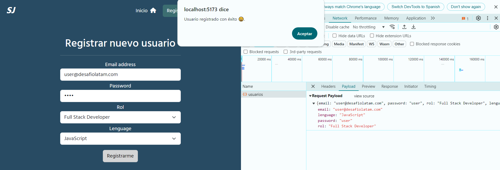
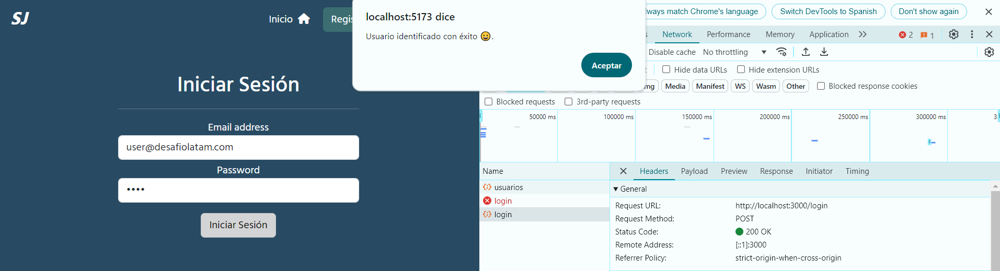
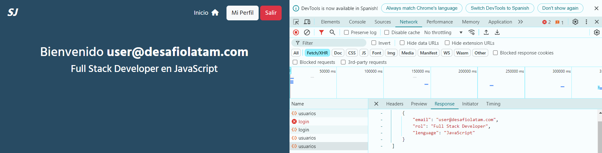

# Desafío - Soft Jobs 🚀

Este proyecto es parte del desafío propuesto en el Bootcamp de Desafío Latam, en el cual se desarrolló un servidor backend para la plataforma "Soft Jobs". Esta plataforma está diseñada para ayudar a desarrolladores juniors a conseguir trabajos cortos y sencillos para acumular experiencia laboral.

## Descripción 📋

El objetivo del desafío es crear un servidor que maneje la autenticación y autorización de usuarios utilizando JSON Web Tokens (JWT). Se proporcionó una aplicación cliente desarrollada en React para consumir las rutas de este servidor.

### Funcionalidades 🔧

1. **Registro de Usuarios**:
   - Ruta: `POST /usuarios`
   - Permite registrar nuevos usuarios en la base de datos.
   - Datos requeridos: `email`, `password`, `rol`, `lenguage`.
   - La contraseña se encripta utilizando `bcrypt` antes de almacenarse.

2. **Inicio de Sesión**:
   - Ruta: `POST /login`
   - Verifica las credenciales del usuario y devuelve un token JWT en caso de éxito.
   - El token contiene el email del usuario y tiene una expiración de 1 hora.

3. **Obtener Datos del Usuario**:
   - Ruta: `GET /usuarios`
   - Requiere un token JWT en la cabecera de la solicitud (en el campo `Authorization`).
   - Decodifica el token para obtener el email del usuario y retorna sus datos (`email`, `rol`, `lenguage`).

### Requerimientos del Desafío 🎯

1. **Registro y obtención de usuarios**: (1.5 puntos)
   - La API debe permitir registrar nuevos usuarios y obtener información de usuarios autenticados.

2. **Uso de Middlewares**: (2 puntos)
   - Verificar la existencia de credenciales.
   - Validar el token JWT en las rutas protegidas.
   - Reportar las consultas recibidas en el servidor usando `morgan`.

3. **Manejo de JWT**: (3 puntos)
   - Firmar, verificar y decodificar tokens JWT.

4. **Manejo de Errores**: (0.5 puntos)
   - Capturar y devolver los posibles errores que ocurran en el servidor.

5. **Encriptación de Contraseñas**: (3 puntos)
   - Las contraseñas se encriptan usando `bcrypt` antes de guardarlas en la base de datos.

## Estructura del Proyecto 📂

- **app.js**: Archivo principal del servidor donde se configuran las rutas y middlewares.
- **desarrolladores.models.js**: Módulo que contiene las funciones para interactuar con la base de datos PostgreSQL.
- **db_connect.js**: Archivo de configuración y conexión a la base de datos.
- **auth.middleware.js**: Middleware para verificar la validez del token JWT.
- **utils/auth/jwt.js**: Módulo que maneja la firma, verificación y decodificación de tokens JWT.
- **package.json**: Archivo que define las dependencias del proyecto.

### Base de Datos 🗄️

La base de datos utilizada es PostgreSQL, y su estructura es la siguiente:

```sql
CREATE DATABASE softjobs;

\c softjobs;

CREATE TABLE usuarios (
  id        SERIAL        NOT NULL,
  email     VARCHAR(50)   NOT NULL  UNIQUE,
  password  VARCHAR(60)   NOT NULL,
  rol       VARCHAR(25)   NOT NULL,
  lenguage  VARCHAR(20)   NOT NULL,
  PRIMARY KEY (id)
);
```

### Capturas de pantalla 📸

- Registro de Usuario: Permite registrar un nuevo usuario.

- Inicio de Sesión: Los usuarios pueden iniciar sesión y recibir un token JWT.

- Perfil del Usuario: Muestra los datos del usuario autenticado.


## Uso de la Aplicación 🚀

### Instalación

Para instalar las dependencias y ejecutar la aplicación, utiliza los siguientes comandos:
- npm install
- npm run dev

### Endpoints Disponibles

- POST /usuarios: Registra un nuevo usuario.
- POST /login: Inicia sesión y devuelve un token JWT.
- GET /usuarios: Obtiene los datos del usuario autenticado.

## Tecnologías Utilizadas 💻

- **Node.js**
- **Express.js**
- **PostgreSQL**
- **JSON Web Tokens (JWT)**
- **Bcrypt**
- **CORS**

## Mejoras Futuras 🚀

- Implementar validaciones adicionales para mejorar la seguridad.
- Añadir pruebas unitarias para garantizar la robustez del código.
- Expandir la funcionalidad del backend con más características relacionadas con la gestión de empleos.